# Flutter Boilerplate Project using Provider with Firebase Authentication and Firestore

This is the **boilerplate project** for anyone that want to create **Flutter mobile application using Provider, Shared Preferences and Firebase**.


## Motivation

The project contains the minimal implementation required to create a new Flutter project using Provider for state management and Firebase as the backend connectivity for user authorisation control and Firestore for database.

The project come with preloaded folder structure recommended for Provider and separation of business logic, user interface and services needed for any Flutter Firebase project. Apart from that, it come with commonly used files and widgets such as app theme, constants and common Firebase code.

Instead of spending time in every new project to setup development structure, copy and paste, this will help in reducing the common code practise and structure, and quickly allow us to focus on the core part of the app, avoiding writing again and again the same code from scratch.


## Project Goals

The main goal is to define a reference architecture that can be used as the foundation for Flutter app that require the usage of Firebase and eventually:

- To reduce developer time in re-writing common code and project structure from scratch
- To have a common folder and package structure that can be further extended should it require
- Clearing define the app layer – UI layer, business logic layer and service layer

The 3 main layers:
- UI layer – all UI widgets files
- Business logic layer – contains all app business and presentation logic
- Service layer – contains services needed to interact with between the app and 3rd party services such as APIs

This project bundled with a demo app as a practical example of this architecture.


## Demo App: Todo App

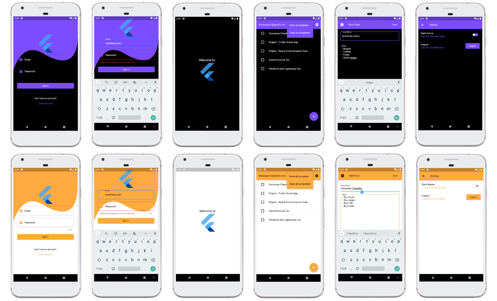

The demo app demonstrates a simple but comprehensive enough to capture the various challenges and use cases of state management across multiple screens and different modules. 

After signed into the app, users can view, create, edit and delete their todo notes. User can change the theme and data is stored in Firebase Firestore.


## How to Use

### Step 1:
Download or clone this repo by using the following link:
[https://github.com/KenAragorn/create_flutter_provider_app.git](https://github.com/KenAragorn/create_flutter_provider_app.git)

### Step 2:
Go to your local extracted clone copy of the project, open the android/build.gradle file and change the applicationId to your own application ID. For example, com.your_com_name.project_name. 
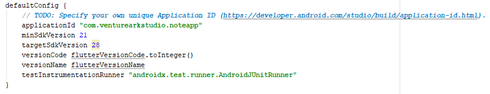

### Step 3:
Go to the project root and execute the following command to get all dependencies packages:
```flutter pub get```

### Step 4:
Go to your [Firebase](https://console.firebase.google.com/) console. Create a new Firebase project. Once created without any issue, register your app by clicking the icon – for Android, click on the Android icon and for iOS, click on the iOS icon. Complete the rest of the step require.
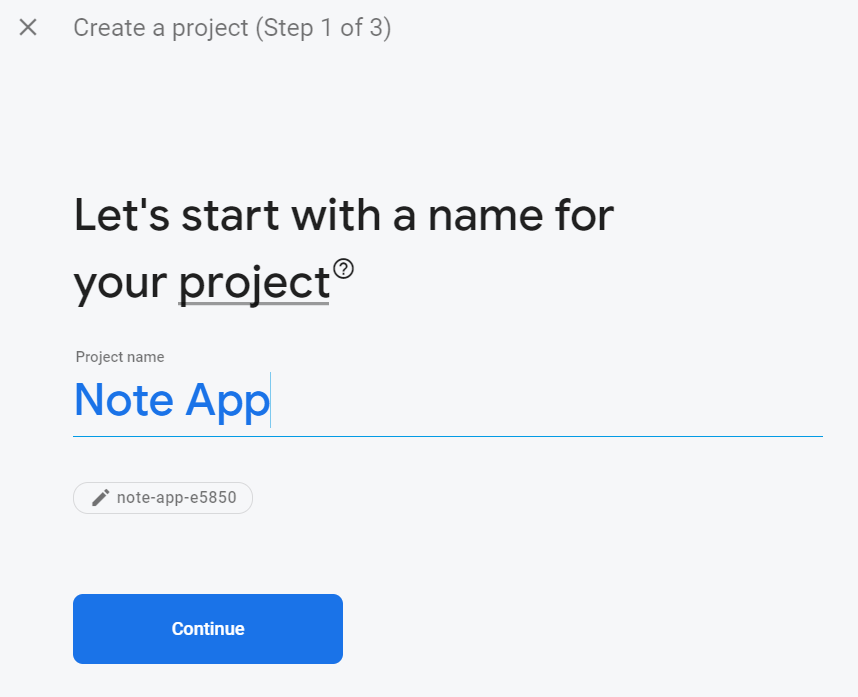


### Step 5:
Ensure the Android package name is the same value as your application ID setup in step 2.
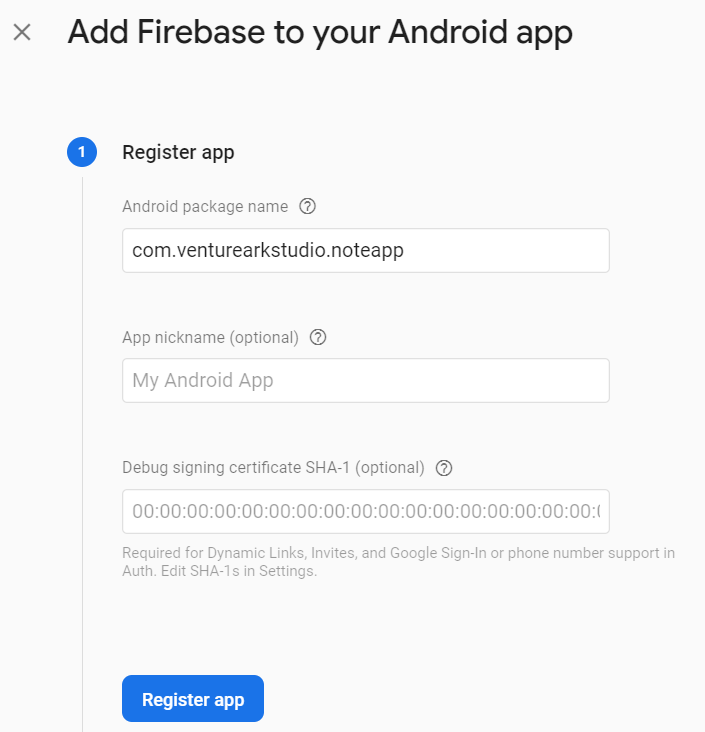

### Step 6:
Download the google-services.json file provided by Firebase to the android/app directory. Then, update the Gradle build files under android/build.gradle to register the app with Google services.
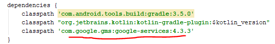

### Step 7:
Update the android/app/build.gradle file by adding the following highlighted code:
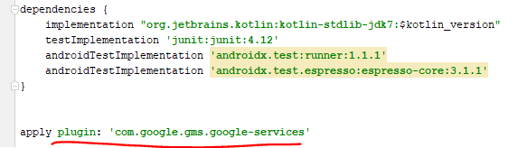

### Step 8:
Go back to your Firebase console to create the database Cloud Firestore. Choose the test mode option. You can change it later, just make sure to choose the nearer Cloud Firestore location nearer to your location.
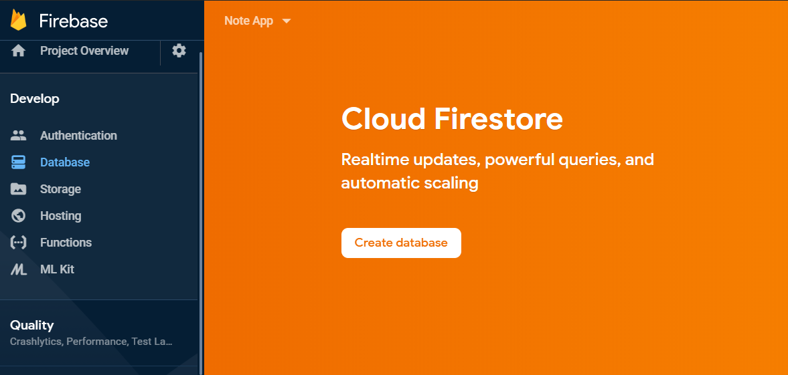

### Step 9:
Still within Fiebase console, go to Authentication and turn on the sign-in method. In our case, that would be email/password have to turn on by setting the status to enabled. Other sign-in method will be added soon.
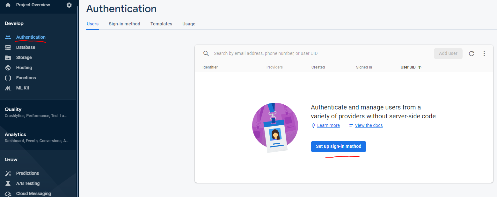

### Step 10:
Done. Try launch the app using emulator or your preferred physical test device. For first time user, you need to create a new account from the app. 


## Third Party Libraries Dependencies:

* [Provider](https://github.com/rrousselGit/provider)
* [Firebase Auth](https://pub.dev/packages/firebase_auth)
* [Cloud Firestore](https://pub.dev/packages/cloud_firestore)
* [Shared Preferences](https://pub.dev/packages/shared_preferences)
* [Flutter Platform Widgets](https://pub.dev/packages/flutter_platform_widgets)
* [Flutter Localizations](https://flutter.dev/docs/development/accessibility-and-localization/internationalization)

## Project Key Features:

* Splash Screen
* New User Registration & Login - Firebase Auth - Email/Password only (more will be added soon)
* Routing – Separation of routing files for ease of maintenance
* Theme – Separation of theme files that support dark and light theme
* Provider – State management
* Caching – Using SharedPreferences to keep track theme selection
* Internationalization – **Newly added - 11 April 2020** 
* Multiple Build Environment – Using multiple Flavors to connect 2 different Firebase environment - Dev and Production **Newly added - 23 April 2020** 

## Folder Structure: 
```
lib/
|- constants/ – contains all application level constants for theme, font types and app strings.
|- caches/ – contains data layer such as shared preferences.
|- models/ – contains all the plain data models.
|- services/ – contains all services files that handle the API calling for CRUD related functionalities.
|- providers/ – contains all Provider models for each of the widget views.
|- ui/ the main folder that will contains all UI related breaking down further by different modules (such as authentication, home, etc) and sub section (reusable widgets and screens).
|- routes.dart
|- app_localizations.dart
|- auth_widget_builder.dart
|- flavor.dart - main class for handling the multiple build - dev and production
|- my_app.dart
|- main.dart - the main.dart file for dev environment (means, connecting to Firebase Cloud Database Dev)
|- main_prod.dart - the main.dart for production environment (means, connecting to Firebase Cloud Database Production)
```

### What inside constants?
Basically, all needed constant files for the application to work will be here. 
```
constants/
|- app_themes.dart – the theme file for the app
|- app_font_family.dart – the app global supported font family
```

### What inside cache?
As of now, only shared preferences files. In future we may have others such as sqlite features and it is good to keep things separated.
```
caches/
|- sharedpref/shared_preference_helper.dart
```

### What inside models?
All plain data models file will be here. Depending on the number of the model files, if it is more than 10 files, we suggest separating the files by sub folder such as models/auth, models/todo etc. Else, keep it simple with every data model file is within this folder.
```
models/
|- user_model.dart
|- todo_model.dart
```

### What inside services?
As we have backend firestore and firebase for application data such as user and todo data, we will need a dart classes that represent the CRUD services to handle any communication between the UI code and the backend. 
```
services/
|- firestore_database.dart
|- firestore_service.dart
|- firestore_path.dart
```

### What inside providers?
Contains all provider models needed for the app. The idea is like those in models and services in which, different provider class will be created for different key modules.
```
providers/
|- auth_provider.dart
|- theme_provider.dart
```

### What inside UI?
This directory contains all the UI files for the application. As most of the times, there will be more than 1 files representing a screen, thus is always good to separate it by sub-folder and grouping it based on their key features or modules. 
```
ui/
|- auth
        |- register_screen.dart
        |- sign_in_screen.dart
|- splash
        |- splash_screen.dart
|- home
        |- home.dart
|- todo
        |- todos_screen.dart
        |- create_edit_todo_screen.dart
```

## Use Case: Firestore Service
Any widgets module can subsribe to updates from Firebase Firestore through streams, as well as write operation such as creation and deletion of data using Future-based APIs.

For convenient, all Firestore related CRUD services for the demo app is all in 1 place:
```dart
class FirestoreDatabase { // implementation omitted for brevity
  Future<void> setTodo(TodoModel todo); // create / update
  Future<void> deleteTodo(TodoModel todo); // delete
  Stream<List<TodoModel>> todosStream(); // read
  Stream<Job> todoStream({@required String todoId}); // read
}
```

With this setup, creating a widget that shows a list of jobs becomes simple:
```dart
@override
Widget build(BuildContext context) {
  final database = Provider.of<FirestoreDatabase>(context, listen: false);
  return StreamBuilder<List<Job>>(
    stream: database.todosStream(),
    builder: (context, snapshot) {
      // TODO: return widget based on snapshot
    },
  );
}
```
Domain-level model classes are defined, along with `fromMap()` and `toMap()` methods for serialization.

### Note about stream-dependant services
When using Firestore, is quite common to organise user data inside documents or collections that depend on the unique user `uid`. 

When reading or writing data, the app need to access to the user `uid`. This can change at runtime, as user can log out and sign back in with a different account, which eventually a different `uid`.

This, the `FirestoreDatabase` takes the `uid` as a constructor parameter. So, the moment we have `FirebaseUser` upon user logged in, we can just pass the `uid` to the Firestore database when performing CRUD operations.

To achieve this, `FirestoreDatabase` will be re-created everytime `onAuthStateChanged` changed.

## Use Case: Internationalization
Added Internationalization features to the project. The example contains 2 languages namely English and Chinese. 

With this, the sample app now contains feature that allow user to change language from English to Chinese and vice-versa. 

This feature is added at Setting page - concept works the same as theme.

There are 2 JSON files that contains key-value pairs of strings for English and Chinese.

This 2 files is located at new folder called lang under the project root folder. 

```
lang/
|- en.json
|- zh.json
```

By using JSON, it will be easier to manage as you can give it to translator to translate the words without needing them to access the code.

The pubspec.yaml is updated to include dependency for flutter_localizations. Also, added the asset reference for the new folder lang.

Below are the steps require to add for additional languages.
1. Create a new JSON file for the new language file. For example, sk.json for Slovak.
2. Copy the content of en.json/zh.json to the new json file. 
3. Pass the new JSON file to translator or do it yourself and update the word to the right word.
4. Update the main.dart to include the additional supported locales for the additional language. Inside main.dart:
```
supportedLocales: [
Locale('en', 'US'), 
Locale('zh', 'CN'),
Locale('sk', 'SK')  //example, if you add the Slovakian language 
],
```
5. Update the app_localizations.dart to include additional supported locales for the additional language:
```
  @override
  bool isSupported(Locale locale) {
    // Include all of your supported language codes here
    return ['en', 'zh', 'sk'].contains(locale.languageCode);
  }
```
6. **Take note**, if you prefer the app to be responsive to the phone actual locale setting and do not allow the app to contain any feature to change the language display, then you need to comment out the code at main.dart:
```
  return MaterialApp(
      debugShowCheckedModeBanner: false,
      locale: languageProviderRef.appLocale,   // <-- comment out this code
```
By comment out the code ``` locale: languageProviderRef.appLocale```, the app will response only to the system locale setting. For example:

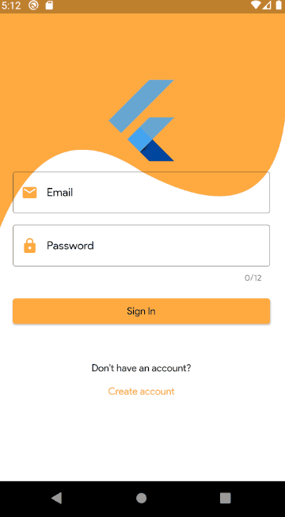

## Use Case: Multiple Build Environment – Using multiple Flavors
Added configurations and further enhanced the project structure with new codes to handle multiple build environment. 

It is always a good practise to build separate apps from the same source code and for different environment such as development, staging and production.

In this latest update, we added 2 build environment namely development and production. 

Below are the steps for existing developers that used the older code and what need to be done to make your local project to have multiple build.

1. Create 2 Different Firebase Projects and Configuration 
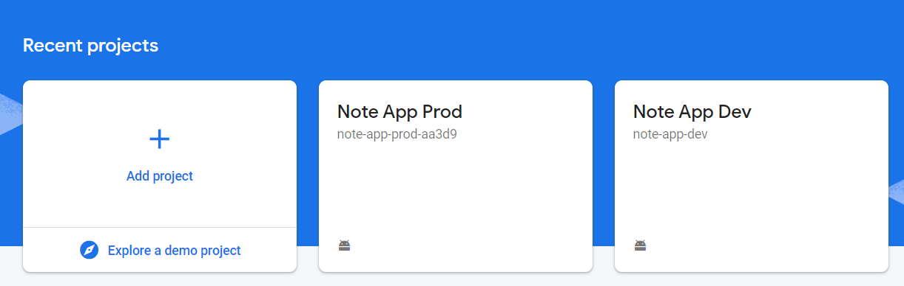
For this, as mentioned earlier, we will be defining 2 environments namely development and production, so we will need to create 2 Firebase projects. 
Then, for each Firebase projects, create a Cloud Firestore database. Do remember to have at least 1 sign-in method enabled for both projects – for this example, we are using Email/Password only.
Next, we need to get the google-services.json for each Firebase project. 

To do that, lets assume we will be using the following applicationId for both environment:
-	Note App Prod – applicationId: com.example.create_flutter_provider_app.prod
-	Note App Dev - applicationId: com.example.create_flutter_provider_app.dev

You can use your preference naming convention for the applicationId, as long it is understandable that 1 is for production environment and another is for development environment.
With the applicationId defined, we will used it to add Firebase to our project. 
Go to each Firebase project, click on the small Android icon and the following screen will appear. Add the applicationId to the right Firebase project as specified above.
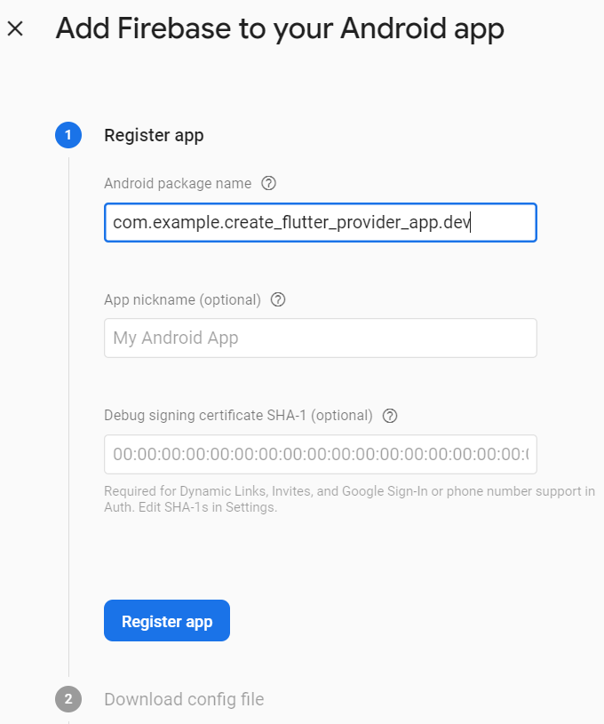
Once registering the app, download the google-services.json for each Firebase projects.

2. Updating Project Config Files
Add in the following configuration into the project android/app/build.gradle:
```
    flavorDimensions "flavor-type"

    productFlavors {
        dev {
            dimension "flavor-type"
            applicationId "com.example.create_flutter_provider_app.dev"
            versionCode 1
            versionName "1.0"
        }
        prod{
            dimension "flavor-type"
            applicationId "com.example.create_flutter_provider_app.prod"
            versionCode 1
            versionName "1.0"
        }
    }
```
An example:


3. Create 2 folders Representing Development and Production

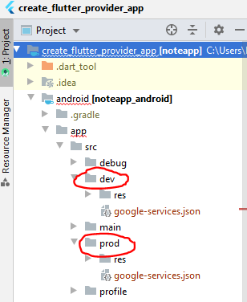

The folder name must match the named specified in productFlavors (android/app/build.gradle). 
The previous downloaded google-services.json files for both Firebase projects need to be moved to the right folder. 
For the file downloaded from Note App Prod, place it under the folder prod and for the same file name downloaded from Note App Dev, place it under the dev folder.
For the sub folder called ‘res’, ignore it for now. We will go through that shortly.

4. Having different app name and app icon for Dev and Prod
We want to have a different app name for our project. This is helpful as with Flavor setup, we can install both app in the same devices for testing. 
Having app name such as NoteApp-Dev or Note-Dev or Note-Prod helps us to identify which app is for which environment – development or production.
The same concept and benefits if we have different app icon for each apps that are connecting to different environment. 
For app name, create file called strings.xml and with the following content:
```
<?xml version="1.0" encoding="utf-8"?>
<resources>
        <string name="app_name">Note-Dev</string>
</resources>

```
Change the app_name to fit your Dev app. Put this file under the dev/res/values:


Do the same for the prod environment but name your app_name to be Note-Prod or something that represent it is the app for Production.
```
<?xml version="1.0" encoding="utf-8"?>
<resources>
        <string name="app_name">Note-Prod</string>
</resources>

```
The final step for the app name is to change the Android manifest file to refer to the String name app_name. 
To do that, open the file AndroidManifest.xml located at android/app/src/main folder. Update the android:label as follow:
```
android:label="@string/app_name"

```
Next, for the images, copied all 5 sub folders that start with the name mipmap-xxx from main/res/, and paste it to the res folder for both dev and prod. 
At the end, you should have the following view:

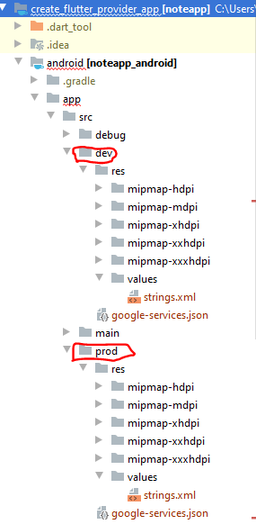

If you notice, each sub-folder with the name minimap contains images and that image is the app icon image. Change it to your needs. 

5. New Dart files and Code Updates
Create a flavour.dart file. This will just contain enum value that represent both dev and prod environment that the main class can refer and decide. 
The code:
```
enum Flavor {dev, prod}
```
Since we are using the Flutter template shared above, we will need to create additional main.dart that represent the production build and using the original main.dart to be representing as development build.
Our goal is to able to build and run different flavor as follow:
```
flutter run --flavor dev -t lib/main.dart
flutter run --flavor prod -t lib/main_prod.dart
```
First, update the main.dart as follow:
```
void main() {
  WidgetsFlutterBinding.ensureInitialized();
  SystemChrome.setPreferredOrientations([DeviceOrientation.portraitUp])
      .then((_) async {
    runApp(
      MultiProvider(
        providers: [
          Provider<Flavor>.value(value: Flavor.dev),
          ChangeNotifierProvider<ThemeProvider>(
            create: (context) => ThemeProvider(),
          ),
          ChangeNotifierProvider<AuthProvider>(
            create: (context) => AuthProvider(),
          ),
          ChangeNotifierProvider<LanguageProvider>(
            create: (context) => LanguageProvider(),
          ),
        ],
        child: MyApp(
          databaseBuilder: (_, uid) => FirestoreDatabase(uid: uid),
        ),
      ),
    );
  });
}

```
As mentioned before, we will make the main.dart as the representative of building a development build. 
As this project is using Provider, we will pre-set the main.dart to use the dev flavor. 
Duplicate this file and renamed it as main_prod.dart. Update the Flavor.dev to Flavor.prod.
Then, apart from the previous app name and app icon changes, we felt it is also necessary to display some info at the first screen namely the sign-in screen. 
Thus, since we are using Provider to set the initial value of the both main.dart and main_prod.dart, we then can access this initial default value at the sign-in screen as follow:
```
Text(
  Provider.of<Flavor>(context).toString(),
),
```
So, what will happen if we were to run the following code:
```
flutter run --flavor dev -t lib/main.dart
```
Flutter will try to build and run the app using the flavor dev and using the main.dart file. 
This will result the following display of sign-in screen:

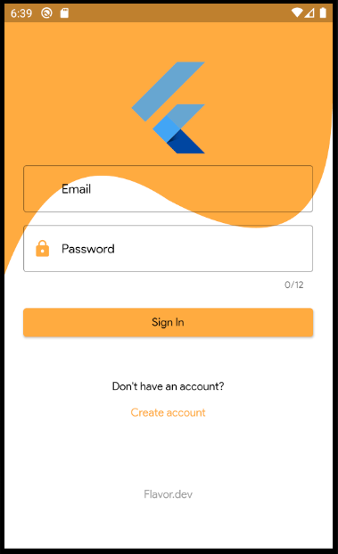

Notice the bottom part, it contains the value of the enum value dev.

The command: ```flutter run --flavor dev -t lib/main.dart``` is basically telling Flutter to build the app for testing using the flavour dev specified in the build.gradle. 
Also, the second part is basically telling it to run it using main.dart file. And since our main.dart has the initial flavor value pre-set as dev, it will be display as Flavor.dev.
If were to run the command: ```flutter run --flavor prod -t lib/main_prod.dart```, will result the following:

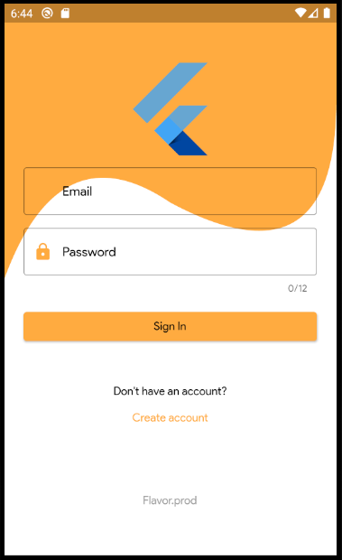

Notice the bottom of the screen, it is displaying Flavor.prod.

## Future Roadmap
* Additional Sign-in method - Google
* Animation
* ~~Separation of different build flavors~~
* ~~Internationalization~~

## Conclusion
Again, take note, this is an example from my few mobile app projects, and instead of repeating the same process over and over again, I decided to spend some time to create this architecture that is easier to onboard for any new Flutter project that used Provider and Firebase.
If you liked my work, don’t forget to ⭐ star the repo to show your support.

## [License: MIT](LICENSE.md)


